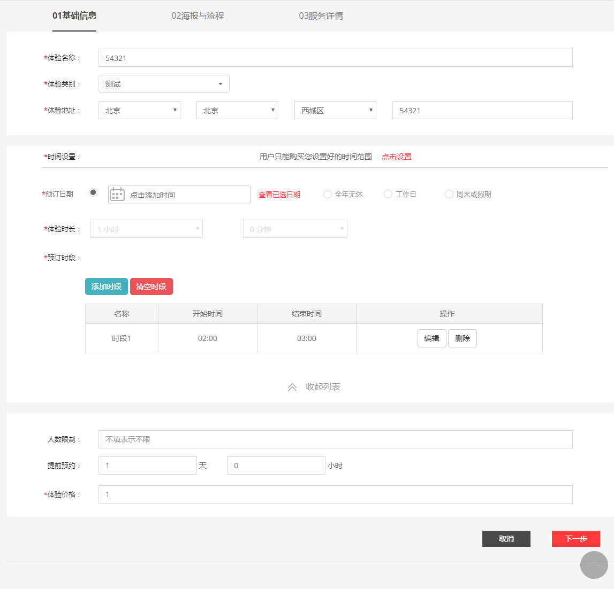
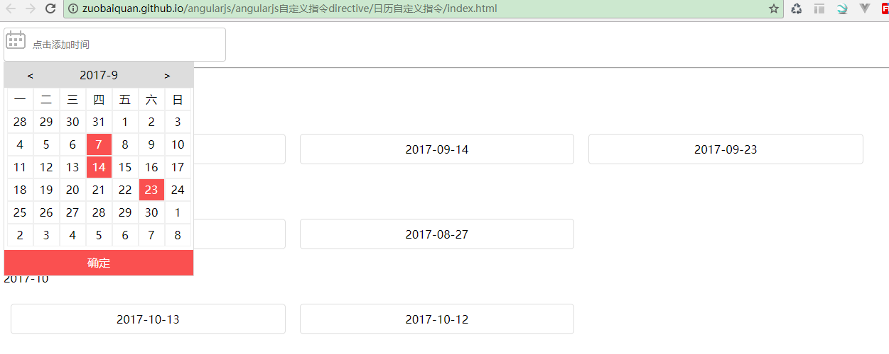
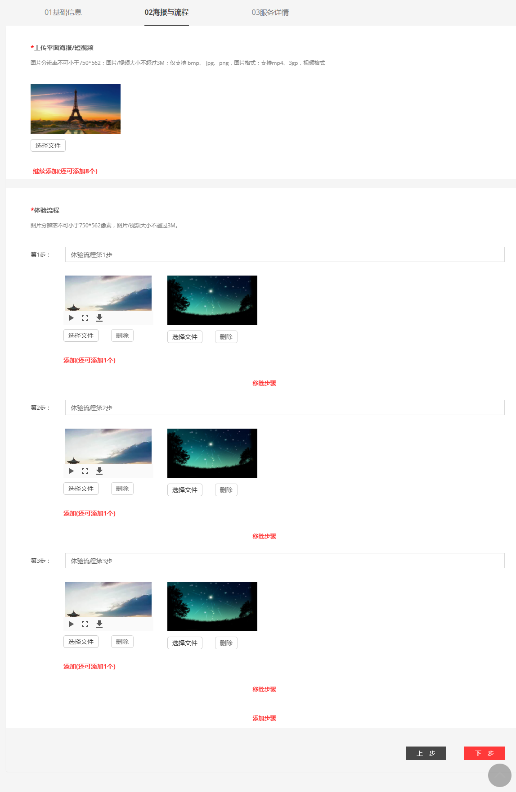
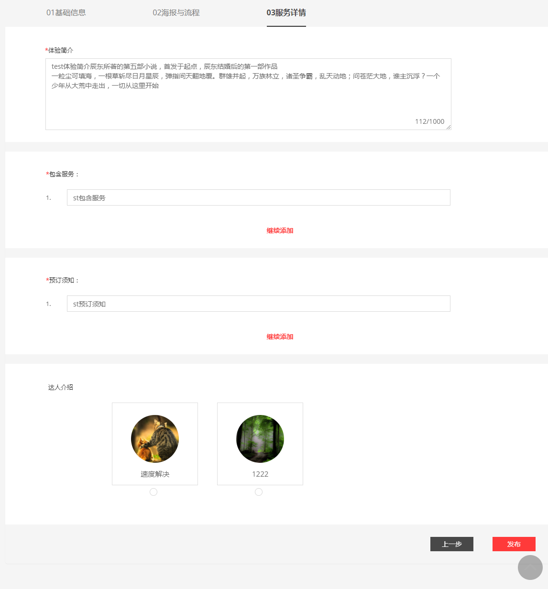
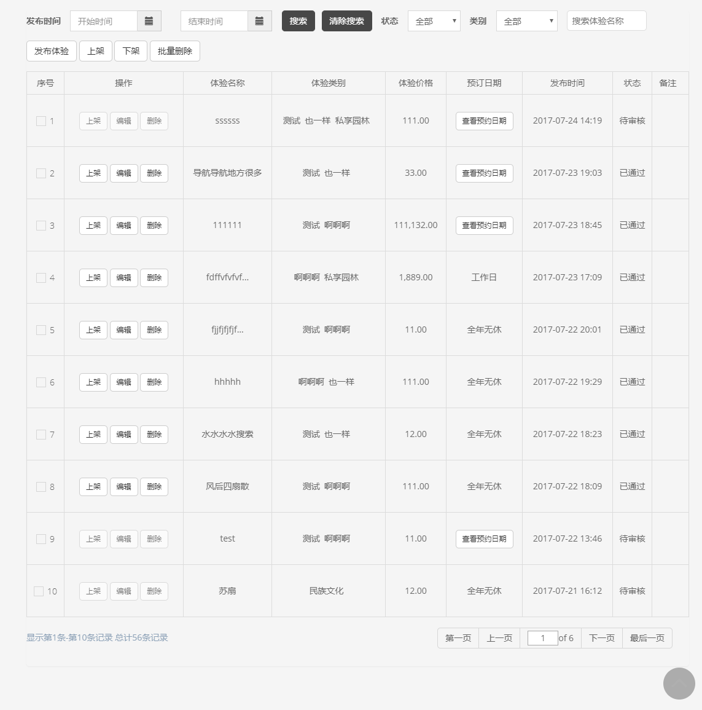

# ugogo

是一款服务于广大的游客打造的生活旅游服务平台，让你轻松掌握最新的旅游资讯，资讯分享精彩的旅游生活.

### 部分项目截图

预选日期 自写了一个多选日期插件(过去的日期不能选)

http://zuobaiquan.github.io/angularjs/angularjs%E8%87%AA%E5%AE%9A%E4%B9%89%E6%8C%87%E4%BB%A4directive/%E6%97%A5%E5%8E%86%E8%87%AA%E5%AE%9A%E4%B9%89%E6%8C%87%E4%BB%A4/index.html

嵌入的h5页面分享页面

https://web.ugogo.net/#/detail?id=34&accountId=81

嵌入安卓ios的营业报表（按照月份，日期查询，营业额数据上升趋势等功能）

服务费率页面https://web.ugogo.net/#/platservice?rate=12

关于我们、用户协议等h5页面都是嵌入安卓ios客户端

邀请好友 http://web.ugogo.net/#/joinus  等